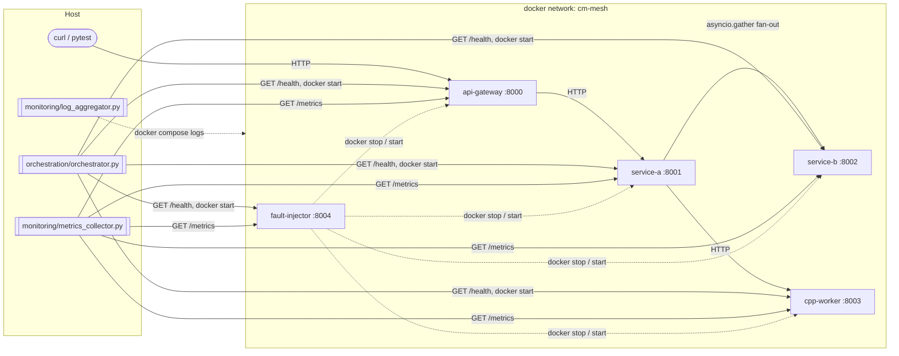

# Cloud Microservices Architecture & Integration Framework

[](https://github.com/IegorKovalov/cloud-microservices/actions/workflows/ci.yml)
[](https://www.python.org/downloads/)
[](https://en.cppreference.com/w/cpp/17)
[](#license)

A multi-service distributed system that demonstrates production patterns end-to-end: an API gateway, an async Python worker, a Python storage service, a C++17 compute worker, and a chaos-engineering fault-injector — all wired together with Docker Compose, polled by Python automation scripts that detect failures and restart services automatically. Inter-service communication is async HTTP only; every service emits structured JSON logs and exposes uniform `/health` and `/metrics` endpoints. The orchestrator, recovery loop, log aggregator, and metrics collector together form a small but realistic ops control plane on top of the running stack.

## Architecture



### Services

| Service | Language | Purpose |
| --- | --- | --- |
| `api-gateway` | Python (FastAPI) | Stable edge URL; proxies `/process` to `service-a`; aggregates `/system/health`. |
| `service-a` | Python (FastAPI) | Concurrency demo: `asyncio.gather` fan-out, `asyncio.Queue` worker pool, `ThreadPoolExecutor` variant. |
| `service-b` | Python (FastAPI) | Async-safe in-memory key/value store + a `/squared` compute endpoint. |
| `cpp-worker` | C++17 (cpp-httplib) | High-performance `square_sum` powered by a thread pool with mutex-protected accumulator. |
| `fault-injector` | Python (FastAPI) | Chaos control plane: `docker stop/start`, configurable latency and error injection. |

## Prerequisites

- Docker Engine 24+ and the `docker compose` plugin
- Python 3.11+ (only required for the host-side scripts and tests)
- `cmake` 3.20+ — only required if you want clangd to resolve `cpp-worker` headers in your editor (run `make cpp-prep` once, see [runbook §9](docs/runbook.md#9-ide-setup-for-cpp-worker-one-time)). The Docker build does not need cmake on the host.

## Quick start

```bash
git clone https://github.com/IegorKovalov/cloud-microservices.git
cd cloud-microservices
make up                                  # builds & starts the full stack
curl http://localhost:8000/health        # -> {"status":"ok","service":"api-gateway",...}
make health                              # one-shot health probe across every service
make test                                # unit + integration tests
make down                                # tears the stack down
```

Run a real request through the pipeline:

```bash
curl -sS -X POST http://localhost:8000/process \
  -H 'content-type: application/json' \
  -d '{"items":[1,2,3,4,5],"operation":"square_sum"}' | jq
```

The gateway forwards to `service-a`, which in turn fans out to `service-b` for each item (via `asyncio.gather`), calls `cpp-worker` for the squared sum, and aggregates the result.

## Demo: fault injection & automatic recovery

This sequence shows the orchestrator detecting a downed container and bringing it back up.

1. **Start the stack** (or assume it's already running):

   ```bash
   make up
   ```

2. **In one terminal, run the recovery loop**:

   ```bash
   make orchestrate
   # (or: python -m orchestration.recovery)
   ```

3. **In another terminal, kill `service-a` via the chaos plane**:

   ```bash
   make fault-inject
   # equivalent to:
   curl -sS -X POST http://localhost:8004/inject/kill \
        -H 'content-type: application/json' \
        -d '{"target":"service-a"}'
   ```

4. **Observe**:
   - The orchestrator's logs show three consecutive `health_check_failed` warnings for `service-a`.
   - Then a single `recovery_event` line with `success=true`, `action=docker_start`.
   - `make health` shows `service-a` healthy again within a few seconds.

5. **Latency / 5xx variants** (optional):

   ```bash
   curl -sS -X POST http://localhost:8004/inject/latency \
        -H 'content-type: application/json' -d '{"target":"self","duration_ms":1500}'
   curl http://localhost:8004/slow   # takes ~1.5s

   curl -sS -X POST http://localhost:8004/inject/error \
        -H 'content-type: application/json' -d '{"target":"self","error_rate":1.0}'
   curl -i http://localhost:8004/broken   # always 500 until rate is reset
   ```

## Observability

- **Logs**: every service emits structured JSON logs to stdout. Tail and parse them with:

  ```bash
  make aggregate    # python -m monitoring.log_aggregator
  ```

- **Metrics**: every service exposes `GET /metrics`. Snapshot them all into `metrics/metrics.json` and append a per-tick line to `metrics/metrics.json.history.jsonl`:

  ```bash
  make collect      # python -m monitoring.metrics_collector
  ```

## Repository layout

```
cloud-microservices/
├── services/
│   ├── api-gateway/
│   ├── service-a/
│   ├── service-b/
│   ├── cpp-worker/
│   └── fault-injector/
├── orchestration/         # host-side python automation
├── monitoring/            # log aggregator + metrics collector
├── shared/                # models, utils, logging used by every service
├── tests/                 # unit + integration tests
├── docs/                  # architecture.md, runbook.md
├── docker-compose.yml
├── Makefile
└── README.md
```

## Key design decisions

- **HTTP-only inter-service communication, with shared schemas baked in at build time.** Each Dockerfile copies `shared/` into the image rather than mounting a volume, keeping every service self-contained while still guaranteeing one canonical Pydantic schema across the Python services. The C++ worker matches the JSON shape by hand; the schema lives next to a unit test that exercises it.

- **Recovery is observable, not magical.** The orchestrator polls every `/health` endpoint on a fixed interval and only escalates to `docker start` after a configurable number of consecutive failures. Each recovery is recorded as a `RecoveryEvent` and emitted as a structured log line, so `monitoring/log_aggregator.py` can pick it up downstream. This intentionally trades reaction time for stability.

- **Concurrency is demonstrated, not just claimed.** `service-a` ships three different concurrency flavours behind separate routes (`/process`, `/process/queue`, `/process/threadpool`) so the patterns can be benchmarked side by side. The C++ worker uses a custom RAII-managed thread pool with a mutex-guarded accumulator, mirroring the same idea at a different layer of the stack.

## Documentation

- [`docs/architecture.md`](docs/architecture.md) — full system diagram, request lifecycle, per-service responsibilities.
- [`docs/runbook.md`](docs/runbook.md) — how to run tests, inject faults, and add a new service.

## License

MIT.
