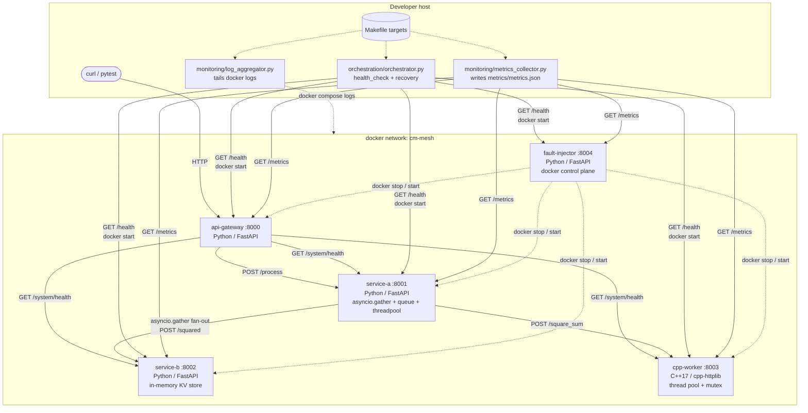
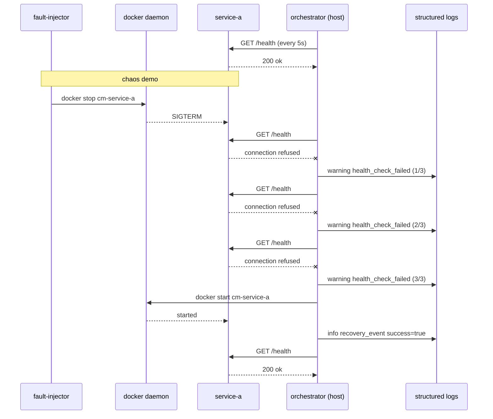

# Architecture

This document describes the system architecture, the responsibilities of each
service, the request lifecycle through the stack, and the failure-recovery
control plane.

## High-level diagram

## Service responsibilities

### `api-gateway` (Python, FastAPI)

- The single, stable URL surface for clients (`localhost:8000`).
- Validates incoming `ProcessRequest` payloads and forwards them to `service-a`.
- Provides `GET /system/health`, which fans out `/health` checks to every
  downstream service via `asyncio.gather` and returns a single aggregated
  document.
- Has its own `/health` and `/metrics` endpoints that follow the same schema
  as every other service.

### `service-a` (Python, FastAPI, async)

- The concurrency demonstrator. Receives `{"items": [...], "operation": ...}`
  and returns a populated `ProcessResponse`.
- Three pipeline flavours, all hitting the same underlying compute:
  - `POST /process` — `asyncio.gather` parallel fan-out to `service-b/squared`,
    bounded by a `Semaphore`. If `operation == "square_sum"`, also calls
    `cpp-worker/square_sum` and surfaces the result on the response.
  - `POST /process/queue` — fixed pool of `asyncio.Queue` consumers.
  - `POST /process/threadpool` — `concurrent.futures.ThreadPoolExecutor`
    wrapped in `asyncio.to_thread` so the event loop stays responsive.
- Uses a single shared `httpx.AsyncClient` managed via FastAPI lifespan.
- Has a thin retry layer (`shared.utils.retry_async`) with exponential
  backoff + jitter for the fan-out call.

### `service-b` (Python, FastAPI)

- Owns the only mutable state in the system: a small in-memory key/value
  store guarded by an `asyncio.Lock`.
- Exposes `POST /store`, `GET /store/{key}`, `GET /store`, `DELETE /store/{key}`.
- Provides the canonical "downstream" endpoint exercised by the fan-out:
  `POST /squared` simply squares the incoming value with a tiny `await
  asyncio.sleep` to simulate I/O latency, so the gather pattern visibly wins.

### `cpp-worker` (C++17, cpp-httplib + nlohmann/json)

- A minimal HTTP server that wraps a custom RAII-managed thread pool.
- `POST /square_sum` partitions the input vector across worker threads,
  computes a partial sum-of-squares per chunk, and merges them under a
  single `std::mutex` — the mutex-protected shared accumulator required
  by the project rules.
- Compiles with `-Wall -Wextra -Werror` inside its own multi-stage Docker
  image; the final runtime image is `debian:bookworm-slim` plus a single
  static-stripped binary.

### `fault-injector` (Python, FastAPI, docker SDK)

- Mounts `/var/run/docker.sock` so it can drive container lifecycle on the
  host docker daemon.
- `POST /inject/kill` — `docker stop` a target container (allow-listed).
- `POST /inject/restart` — `docker start` it again.
- `POST /inject/latency` and `POST /inject/error` — set knobs that affect
  the injector's own `GET /slow` and `GET /broken` endpoints, giving
  predictable, repeatable latency and 5xx demos without modifying any
  other service.

## Cross-cutting concerns

### Observability schema

Every service uses the helpers in `shared/fastapi_app.py`:

- One structured-log line per request, on stdout, with keys
  `service`, `level`, `timestamp`, `message`, plus per-request context
  (`path`, `method`, `status_code`, `duration_ms`, `is_error`).
- `GET /health` returns `HealthStatus(service, status, timestamp)`.
- `GET /metrics` returns `ServiceMetrics(service, request_count,
  error_count, avg_latency_ms, uptime_seconds)`.

The C++ worker matches this contract by hand (see
`services/cpp-worker/src/main.cpp`).

### Configuration

Configuration is environment-only. `.env.example` lists every variable; the
`Makefile` and `docker-compose.yml` both `include`/`source` the local `.env`.
No service hardcodes hostnames or ports.

### Recovery control plane

The recovery logic is implemented in `orchestration/recovery.py` and is
covered by unit tests in `tests/unit/test_recovery.py` that mock both the
HTTP probe (`respx`) and the `docker start` subprocess (`AsyncMock`).

## Data flow: a `square_sum` request

1. Client sends `POST /process {items: [1,2,3], operation: "square_sum"}` to
   `api-gateway`.
2. The gateway middleware records `request_count++`, starts a timer, and
   forwards to `service-a` via the shared `httpx.AsyncClient`.
3. `service-a` calls `fan_out_to_service_b` which `asyncio.gather`s a
   `POST /squared` per item against `service-b`. Concurrency is bounded
   with a `Semaphore`.
4. Because `operation == "square_sum"`, `service-a` also calls
   `cpp-worker/square_sum` for the authoritative parallel result.
5. `service-a` aggregates the fan-out (sum of squares) and returns a
   populated `ProcessResponse`. Both the per-item fan-out result and the
   C++ worker's result are included on the response so callers can
   compare them.
6. The gateway returns the response unchanged. Each hop emits a single
   structured-log line for the request.
